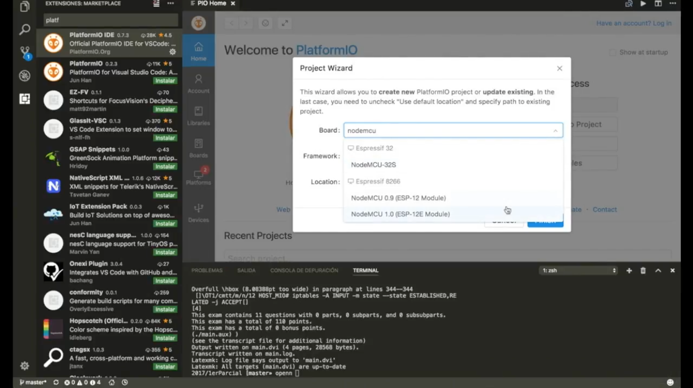

# Pruebas de NTP con Arduino en NodeMCU

NodeMCU es una placa basada en ESP8266 que se puede programar con las APIs de Arduino.

Este proyecto es para el ensayo del protocolo NTP, basado en UDP, tomando el ejemplo de [Github de Arduino para ESP8266](https://github.com/esp8266/Arduino/blob/master/libraries/ESP8266WiFi/examples/NTPClient/NTPClient.ino).

## Salida esperada

```
packet received, length=48
Seconds since Jan 1 1900 = 3715703408
Unix time = 1506714608
The UTC time is 19:50:08
sending NTP packet...
packet received, length=48
Seconds since Jan 1 1900 = 3715703419
Unix time = 1506714619
The UTC time is 19:50:19
```

## Video explicativo

[](https://www.youtube.com/watch?v=1owj9q1bxoU)